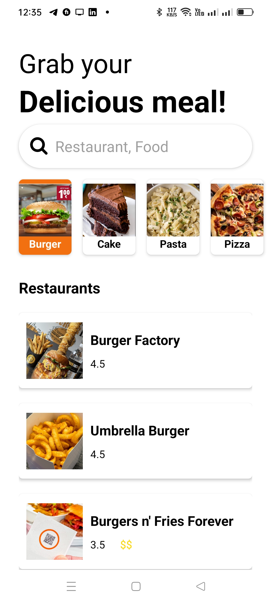
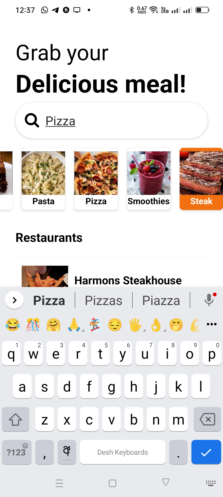

# React Native Restaurant App

### App features.

- View available food categories
- view Category items
- Search for categories
- View Item details

#### Main

#### Search

## Getting Started with create-expo-app

This project was bootstrapped with [create-expo-app](https://docs.expo.dev/tutorial/create-your-first-app/).

### Available Scripts

In the project directory, you can run:

#### `npm start`

Runs the app in the development mode.\
So this will run expo start and is request to view app in your browser, emulator ar mobile device.

The page will reload when you make changes.\
You may also see any lint errors in the console.

#### `npm run android`

This will run "expo start --android",

#### `npm run ios`

This will run "expo start --ios"

#### `npm run web`

This will run "expo start --web",

#### `npm run eject`

This will run"expo eject"
